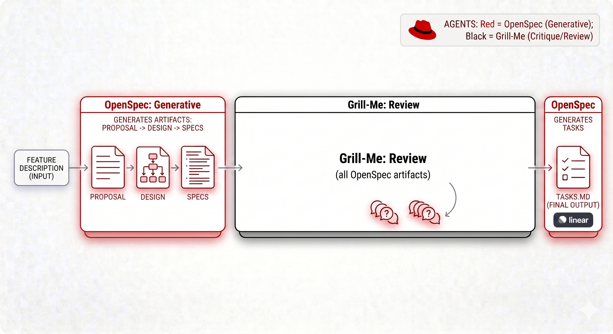

# The OpenSpec refinement workflow

`skills/refinement/` holds the OpenSpec artifact-driven change workflow: eleven
model-invoked skills that create, implement, check, and archive a change under
`openspec/changes/<name>/`. None of them are phase-locked — `openspec-explore`
and `openspec-apply-change` are explicitly usable at any point — but most
changes move through the same rough shape.

## At a glance



This is the concept, not the literal dependency graph: in this repo `specs`
and `design` are siblings that each depend only on `proposal`, not on each
other, so nothing stops writing them in parallel or in either order — only
`tasks` has a real fan-in, requiring both (see below). The `/grilling` review
step is also optional here, offered only when `design.md` leaves a real open
question (`openspec-onboard`'s Phase 7), not a mandatory gate over every
artifact.

## The artifact lifecycle

A change is a folder holding four possible artifacts: `proposal.md`
(why/what), `specs/<capability>/spec.md` (testable WHEN/THEN requirements),
`design.md` (how, with tradeoffs), and `tasks.md` (implementation
checkboxes). Their real dependency graph, from
`skills/reference/rhdh-spec-driven-schema/schemas/rhdh-spec-driven/schema.yaml`:

```
proposal  (no dependencies)
  ├── specs   (depends only on proposal)
  └── design  (depends only on proposal)
        tasks (depends on BOTH specs and design)
```

`specs` and `design` are siblings, not a sequence — neither depends on the
other, so they can be drafted in either order or at the same time. `tasks` is
the only artifact with a real fan-in: it can't be created until both are
done. `openspec-continue-change` still writes them one at a time in a single
conversation and happens to reach `specs` before `design` (it picks "the
first ready one" when more than one is ready), but that ordering is a
one-artifact-per-turn convention, not a dependency.

Three skills create the change folder and its artifacts, differing only in
pace and framing:

| Skill | Pace |
| --- | --- |
| `/openspec-new-change` | Creates the change directory and stops before drafting anything. |
| `/openspec-continue-change` | Creates exactly the next ready artifact, one at a time. |
| `/openspec-ff-change` | Propose a change and generate every artifact in one pass — for a brand-new change or to finish an existing one. |

## Closing a change

- `/openspec-audit-change` — adversarial, pre-implementation: checks the
  proposal, specs, design, and tasks agree with each other (and lightly with
  the codebase) before anyone starts coding.
- `/openspec-verify-change` — post-implementation: checks the code actually
  matches what the artifacts promised (task completion, requirement and
  scenario coverage, design adherence).
- `/openspec-sync-specs` — merges a change's delta specs into the long-lived
  `openspec/specs/` tree without archiving. Runs standalone or as a step
  inside either archive skill.
- `/openspec-archive-change` — archives one finished change to
  `openspec/changes/archive/YYYY-MM-DD-<name>/`, offering to sync specs first.
- `/openspec-bulk-archive-change` — the same, batched, resolving spec
  conflicts across changes by checking what the codebase actually has.

## Learning the cycle

`/openspec-onboard` is the teaching wrapper: it runs one real, small change
through the full cycle above — explore, create, propose, implement, archive —
narrating each step against the user's own codebase, and ends by naming which
of the skills above to reach for next. Use it for "walk me through OpenSpec"
rather than as a dependency of the other ten skills; it does not invoke
them by name, it teaches the same rhythm they implement.

## Dependencies

Every artifact-creating skill (`new-change`, `continue-change`,
`ff-change`) requires the `rhdh-spec-driven-schema` reference skill for the
artifact templates and instructions. `apply-change` additionally requires
`openspec-journal` to record implementation history. `audit-change` uses
`rhdh-spec-driven-schema` optionally, and `archive-change` uses
`openspec-sync-specs` optionally. See
`skills/meta/setup-rhdh-skills/assets/catalog.json` for the authoritative
dependency list.
